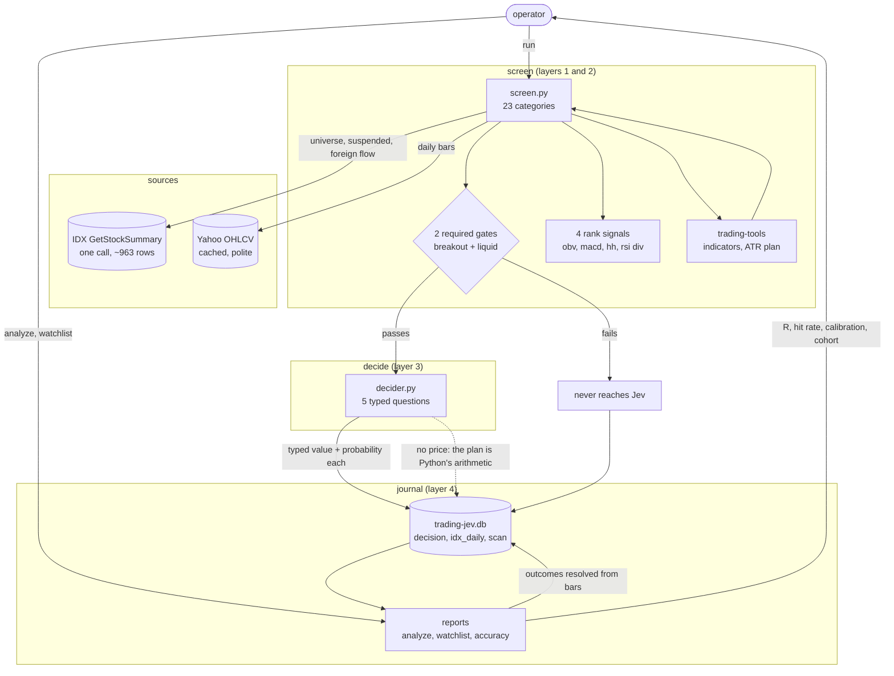
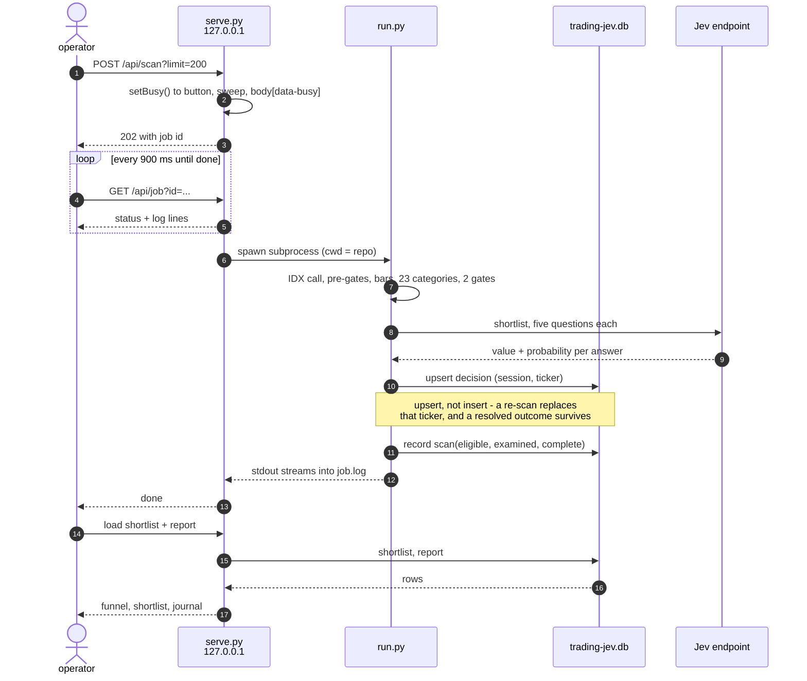

# trading-jev

A momentum screen for the IDX gorengan band where **Jev decides whether to enter**, and a journal
that scores whether Jev was right.

Python fetches the data and computes 23 categories, Jev scores the shortlist over a private
HTTP endpoint, and every decision — ENTER *and* SKIP — is journalled so you can find out
later whether the model earns its place. No orders are placed. A human presses the buy.

`MASTER_PLAN.md` is the design record: why each decision was made, and what the measurements
were. This file is how to run it.

---

## Requirements

- **Python 3.9 or newer** (developed and tested on 3.14). **Standard library only** — there is no
  `pip install` step and no `requirements.txt`, because there is nothing to install.
- **Network access** to `idx.co.id` (universe, suspended list, foreign flow) and Yahoo Finance
  (OHLCV).
- **The `trading-tools` repo** beside this one, at `~/Projects/trading-tools`. This project
  borrows its verified indicators, its Yahoo fetcher and its entry plan rather than
  reimplementing them. If yours lives elsewhere, set `TRADING_TOOLS_DIR`.
- **A credential for the decision endpoint.** Nothing about the provider is written down here:
  the key, the endpoint URL and the model id all live in `.env`. The structured model is only
  served on its own endpoint, not on the provider's chat-shaped one, so an endpoint that works
  elsewhere is not necessarily the right one. Jev is what this project runs on; deciding with a
  chat model instead is an [alternative](#alternative-swap-the-decider-for-a-chat-model).

## Setup

```bash
cp .env.example .env      # then put your key in it
$EDITOR .env              # JEV_API_KEY / JEV_API_URL / JEV_MODEL   (JEV_CHAT_* is the alternative)
```

Or skip the file entirely if your shell already exports them: `export JEV_API_KEY=...`.
`.env` is read only if the variable is not already set.

Check the moving parts before trusting a run:

```bash
python3 pivots.py demo    # pivot rule, no network
python3 store.py          # the journal invariant, on a temp database
python3 decider.py demo   # one real call per backend, same answer contract
python3 idx.py refresh    # the IDX snapshot, prints the filter funnel
```

`python3 run.py --help` lists every command. The database (`trading-jev.db`) is created on first
use; nothing else needs initialising.

---

## How it works

The whole system is four layers, and only two of them are new code. Rendered copies live in
[`docs/pipeline.svg`](docs/pipeline.svg) and [`docs/scan-run.svg`](docs/scan-run.svg) for offline
reading; the `.mmd` sources beside them are the editable originals.



A scan never blocks the page. The browser starts a job, polls it, and the server runs `run.py` as
a subprocess whose stdout becomes the live log:



**The pivot rule is the part worth understanding.** "Last H" as a 20-bar high is useless on a
ranging stock, so a high has to clear four tests: it dominated the prior 20 bars, it stood at
least 2×ATR above the *mean* high of that window, nothing exceeded it for 3 bars, and it gave back
at least 3.5×ATR afterwards. A ranging stock therefore has **no** significant high at all, which
is the sideways filter — the absence *is* the signal, rather than a meaningless level to break.

**Liquidity is a required gate, not a descriptor.** An illiquid momentum entry is one you cannot
exit, and nine gorengan names trade literally nothing. The threshold is IDR 1bn of 20-day average
turnover: the median of 592 names, and a reading where a IDR 100m position is at most ~10% of a
day's volume.

---

## Daily use

```bash
python3 run.py run --limit 200 --top 15
```

One pass, six steps:

1. **Universe** — one `GetStockSummary` call returns ~963 rows. Suspended names (trailing `X` in
   `Remarks`) are dropped. This is the whole universe in a single request.
2. **Pre-gates** — price under IDR 1,000 (the goreng band), and foreign net buy positive. Both
   come out of the stored snapshot, so they cost nothing.
3. **Fetch bars** — daily OHLCV for the surviving candidates, through trading-tools' cached,
   politeness-paced fetcher (8 workers max). `--limit` caps this.
4. **23 categories** — two required gates plus four rank signals, from the bars, the `^JKSE`
   series and the IDX float.
5. **Jev** — the shortlist is scored, ranked, and the top `--top` are sent to Jev.
6. **Journal** — every answer is written down, SKIP included.

A run prints the funnel, the shortlist, and one line per decision. On 20260925 it ended:

```text
scored 231, cleared the required gate: 10
  MGNA   p=0.14 SKIP  rank=2 conv=1.5 risk=medium
  ...
journalled 10 decisions (session 20260925)
```

**A SKIP is a real answer, not a failure.** A day where Jev declines everything is a day the
market had nothing. `analyze` reports the veto rate precisely so you can tell a cautious model
from a broken one.

To screen without spending any Jev calls:

```bash
python3 run.py screen --limit 200
```

---

## Reviewing later

```bash
python3 run.py watchlist                 # every name ever surfaced, and what it did after
python3 run.py analyze --since 7d        # this week
python3 run.py analyze --since 30d       # this month
python3 run.py analyze --since all
python3 run.py resolve                   # just refill outcomes
```

`analyze` first resolves anything pending, then reports over the window:

- **scored / entered / vetoed**, and the veto rate
- **hit rate**, counted only over trades that actually resolved, with `open` and `unresolvable`
  shown as their own counts — never folded in, because dropping them flatters the number
- **cumulative R and an equity curve.** R, not percent: a +4% move on a 3% stop and on a 9% stop
  are different trades, so R divides by the risk that was actually planned.
- **Jev's calibration by `p_enter` bucket.** The metric that decides whether Jev stays. If the
  high-probability buckets are no better than the low ones, the model is noise and the honest
  response is to delete layer 3.
- **The cohort** — every surfaced name and its forward returns at +5/+10/+20 bars with MFE and
  MAE, *including the ones Jev vetoed*. This is the part that scores your vetoes.

A name counts as `EXCLUDED` only if a **complete** scan ran without it. A partial scan (see
`--limit`) proves nothing about exclusion, and with no complete scan on record the status reads
`UNKNOWN` rather than guessing.

---

## How a decision is actually made

| layer | owns |
|---|---|
| data | `idx.py` — IDX snapshot and foreign flow; `tools.py` — Yahoo bars |
| screen | `pivots.py` + `screen.py` — significant highs/lows, the 23 categories |
| decide | `decider.py` — five typed questions, one call, two interchangeable backends |
| journal | `store.py` — the SQLite record everything is scored from |

**Two required gates** — both must pass:

- `breakout` — close above the last confirmed **significant** high. "Significant" means the high
  cleared four tests: it dominated the prior 20 bars, stood ≥2×ATR above the *mean* high of that
  window, was not exceeded for 3 bars, and then gave back ≥3.5×ATR. A ranging stock has no
  significant high at all, which is the sideways filter — the absence *is* the signal.
- `liquid` — average daily turnover ≥ IDR 1bn over 20 bars. A tradability constraint, not a
  signal: an illiquid entry is one you cannot exit.

**Four rank signals** order the shortlist but never block: `obv_rising`, `macd_cross_bull`,
`hh_from_last_h`, `rsi_bull_divergence`.

The rest are descriptors — context Jev reads, recorded in the evidence row so a `p_enter` of
0.31 is readable rather than meaningless.

**Jev's five questions**, asked in one call, all of them returning probabilities:

| question | type | asks |
|---|---|---|
| `verdict` | `choice` | enter, or skip |
| `p_enter` | `noul` | probability of profit over 10 bars |
| `momentum_confirmed` | `noul` | is price-volume momentum confirmed |
| `conviction` | `score` | rubric: no edge / weak / solid / textbook |
| `risk` | `choice` | low / medium / high |

Jev **cannot compute a price**. It returns typed values only, so the entry plan is Python's job
(`stop = entry − 1.5·ATR`, TP1 1R, TP2 2R) and travels with the decision. The no-trade rule is
`verdict.probabilities.enter < 0.6` — a number, not a mood.

**Two backends, one contract.** Jev is what this project runs on. Because the typed reply is
coerced into a shape `decider.py` owns rather than Jev's, the decider can be swapped for a chat
model without touching the pipeline, the journal's schema or `check()`. That swap is an
**alternative** — see [Alternative](#alternative-swap-the-decider-for-a-chat-model) — kept
working and measured rather than deleted.

### Recommended: the local Bekko service

The default decider should be a **local** `hotchpotch/bekko-system-one-v0-17m`, not
a hosted account. It runs on the CPU, answers in about 0.1s per candidate, asks
nothing of the network at run time, and returned a contract-valid answer for
99 of 99 candidates in `eval-bekko.json` (`failed_to_ask: 0`).

It is **not** part of this repository. The model, its venv and its weights live in
`~/Projects/bekko-local` and the Hugging Face cache, and stay there — this repo
holds only the three lines that point at it:

```bash
JEV_BACKEND=structured
JEV_API_URL=http://127.0.0.1:8730/decide
JEV_MODEL=hotchpotch/bekko-system-one-v0-17m
```

`jev run ...` and `jev web` (a wrapper in `~/.local/bin`, not in this repo) start
the service, wait for `/health`, and stop it again when the command exits. A
service you started yourself is left alone.

**Honest limits.** Its probabilities are not calibrated yet: Brier 0.413 against
a 0.237 base rate on n=99, and the top bucket is inverted — where it says 0.81 it
wins 34%. Trust the `verdict` and `conviction` prose; treat
`verdict.probabilities.enter` as a mood until the journal calibrates it, because
the [no-trade gate](#how-a-decision-is-actually-made) reads exactly that number.

### Alternative: swap the decider for a chat model

`JEV_BACKEND=chat` hands a chat-completions model the same five questions as a literal JSON
template and coerces its reply into the identical typed shape. The model's own `type` and `legend`
are discarded — the rubric is ours, not its opinion — `choice` is the argmax of the distribution
it returns, and a missing or zeroed probability distribution is an error rather than a default,
because ENTER is a threshold on that number. Both backends return
`{model, backend, answers, usage}`, both pass the same `check()`, and every journalled row records
which backend and which model answered, so two models can be scored against each other instead of
being blended.

It is an alternative, not the default, and the reason is latency. Jev is a purpose-built
classifier that emits a flat ~120 output tokens; a chat model reasons first and answers second,
and output tokens are what cost seconds:

| decider | latency | in | out |
| --- | --- | --- | --- |
| `jev-1.13-free` (`structured`) | 1.7s / 5.6s | 607 | 120 / 120 |
| `mimo-v2.6-flash` (`chat`) | 7.6s / 17.8s | 744 | 369 / 947 |

On one candidate the two agreed to 0.02 on the enter probability (0.60 vs 0.62) with the same
verdict — n=1, so trust the calibration report over this. Two things the table does not show:
"flash" in a model name says nothing about latency (on this prompt `qwen3.8-flash` took 37s for
2070 output tokens and `glm-5.3-flash` 43s for 1405, both worse than the model above, and
`minimax-m2.7` rejected the protocol outright), and swapping models swaps decisions — the same
candidate scored 0.38, 0.55, 0.62 and 0.68 across four models. A swap is cheap mechanically and
expensive statistically: pick one and let the journal calibrate it.

To use it, set `JEV_BACKEND=chat` in `.env` with its own `JEV_CHAT_URL` / `JEV_CHAT_MODEL` /
`JEV_CHAT_KEY` — a key from one account tier is rejected by the other, so the pairs do not share
a credential — or `run.py run --backend chat` for a single run. The chat endpoint's gateway
requires an `x-opencode-session` header and rejects the standard library's default `User-Agent`;
`_post` sends both.

---

## The web app

```bash
python3 serve.py            # http://127.0.0.1:8787, or the next free port
```

Three views over the same data, no build step and no dependencies:

- **Deepdive** — one ticker, all 23 categories, the five Jev answers as probability bars, the
  entry plan, and the prose state Jev was actually shown. A preview: it does not journal.
- **Scan** — runs a scan and streams the real CLI output live. The funnel and the shortlist are
  read from the same `evaluate()` path the CLI uses, not parsed out of stdout.
- **Journal** — performance over a window, the equity curve in R, Jev's calibration by bucket, the
  watchlist cohort with what each name did after it was surfaced, and a **Refresh** control that
  re-reads the journal without re-analysing it. It is "Refresh" rather than "Update" on purpose:
  the watchlist is a `GROUP BY` over the journal, so it can only show what was already recorded,
  and a test asserts one `/api/watchlist` read and **zero** analysis calls.

**Dark mode** is a token layer, not a second stylesheet: every tint in `app.css` is a
`color-mix()` against `--ink`/`--paper`, so the whole palette inverts from one
`[data-theme="dark"]` block. The toggle follows your OS preference until you choose otherwise, and
a pre-paint script in `<head>` sets it before the stylesheet applies, so a dark-mode user gets no
white flash.

**Loading state** for every process button: the icon breathes on the project's own curve, a
transform-only progress sweep runs above the log, and the deepdive card shows a skeleton. The
looping indicator deliberately does not use `linear` — an infinite rotation needs constant
velocity, but a linear spin is banned by the motion contract and `ease-in-out` pulses visibly.
`prefers-reduced-motion` degrades all of it to the plain disabled state.

Bound to `127.0.0.1` deliberately: this puts a trading decision surface and a key-spending client
on your machine, and nothing needs it to be reachable from anywhere else. It falls forward to the
next free port if the one you ask for is taken. Long work (a scan, a resolve) runs as a background
subprocess with its output streamed into the page, so a one-minute scan is not a one-minute
spinner.

---

## Tests

```bash
python3 test_e2e.py            # the whole suite: 52 tests
python3 test_e2e.py -v         # verbose
python3 test_e2e.py ApiTest    # one suite
E2E_EMPTY=1 python3 test_e2e.py   # simulate a fresh install: no journal at all
```

Stdlib `unittest` plus Playwright, both already installed. The suite starts its own server on a
free port, runs against a **copy** of the journal, and shuts down — so it cannot mutate your
data. That is not theoretical: an early version ran real scans, and a clamped `limit=99999`
silently started a whole-universe scan that journalled ten decisions.

It covers two rings, and both matter:

- **The API** — every endpoint's shape, the error paths (a bad ticker is a 400, not a 500), the
  job lifecycle, argument clamping, and three security properties: the key is never echoed, it is
  never rendered into the page, and the server is not reachable off loopback.
- **The page, in Chromium** — no console errors and no failed requests on any test, all 23
  categories rendering, the sparkline, real rows in both tables, clicking Deepdive, a bad ticker
  showing an error without breaking the page *or discarding the analysis already on screen*, the
  reveal animation firing, dark mode inverting the palette and surviving a reload, the loading
  state appearing on a real job, no banned easing anywhere, `prefers-reduced-motion` being
  honoured, the 375px layout collapsing to one column with no sideways scroll, and every control
  having an accessible name.

Tests that need the decision service skip themselves when it is unavailable, reporting the actual
reason rather than failing on a missing key. Journal-dependent tests skip on a fresh machine, so
a new laptop does not look like a broken install.

## Troubleshooting

| symptom | cause |
|---|---|
| `no JEV_API_KEY — put it in .env` | `.env` missing or empty. See Setup. |
| `cannot load .../ihsg_screener.py` | `trading-tools` is not where it is expected. `export TRADING_TOOLS_DIR=/path/to/trading-tools` |
| `IDX served a bot wall, not data` | IDX escalated to a JS challenge. Install `curl_cffi` in a venv and add Chrome impersonation; today a bare stdlib request works, so this is a future problem, not a current one. |
| `IDX returned non-JSON` | IDX changed the response, or you are being rate limited. Retry later. |
| `no candidate cleared the required gate` | A genuinely dead session, or a `--limit` too small to reach candidates that pass. Raise `--limit`. |
| Yahoo stalls or 429s | Lower `--limit`; trading-tools caps polite fetching at 8 workers. |
| `--since 7x` | Validated and rejected on purpose — a mistyped window used to match nothing, which reads exactly like "no trades that week". Use `all`, `Nd`, or `YYYY-MM-DD`. |
| `UNKNOWN` status on the watchlist | No complete scan recorded yet. Run without a `--limit` that truncates the pool. |
| `Address already in use` from `serve.py` | It now falls forward to the next free port and prints which one it got. Port 8787 is held by `caveman-proxy` on this machine, so expect 8788. |
| SQLite "created in a thread" errors | Only if an old `store.py` is cached in a running process. Connections are thread-local now; restart whatever is running. |

---

## Files

| file | does |
|---|---|
| `tools.py` | the single owner of the `trading-tools` dependency |
| `idx.py` | IDX end-of-day summary: universe, suspended filter, float, foreign flow |
| `pivots.py` | significant highs and lows; self-check proves no repainting |
| `screen.py` | the 23 categories, the two required gates, the rank score |
| `decider.py` | the decision client, the five questions, and both backends |
| `store.py` | SQLite: `idx_daily`, `scan`, `decision`; `report()` and `watchlist()` |
| `run.py` | the pipeline: `screen` · `run` · `resolve` · `watchlist` · `analyze` |
| `serve.py` | the local web app: deepdive, scan, journal |
| `test_e2e.py` | the end-to-end suite: API contract, security, and the page in a real browser |
| `web/` | `index.html`, `app.css`, `app.js` — hand-written, no framework, no CDN |
| `docs/` | diagram sources (`.mmd`) and their rendered `.svg` |
| `design-plans/` | audits and plans kept beside the code, not inside the app |

`.env` and `trading-jev.db` are gitignored. This app is local-only: no deploy target, no CI, no
container. The git repo exists purely so you can `git diff` a strategy change.

---

## Current state, honestly

The journal is **one session deep** (20260925) and contains **zero ENTER decisions** — Jev vetoed
all 11 names it was shown. So every performance figure in `analyze` is currently `n/a`, and that
is the correct output, not a bug. (Those 11 predate the liquidity gate; today's screen clears
only 10, and HYGN at 0.80bn ADV20 is the one it now drops.)

What this means for reading it:

- **The journal is keyed on (session, ticker).** Re-scanning a session replaces that ticker's
  decision instead of adding a second row, and an already-resolved outcome survives the re-scan.
  Before that constraint existed a re-scan double-counted every name, which is exactly what it did
  to this journal once.
- The foreign-flow gate is a **single session** of data. It is the weakest input in the system
  and the one the research says matters most. The window grows automatically as sessions
  accumulate.
- The pivot parameters (1×ATR prominence, ±20 baseline, 3 confirm) were swept over 886 stocks for
  *frequency*, not for edge. They are defensible defaults, not optimal ones.
- The entry plan uses the decision bar's close as the entry, not the next open. Slightly
  flattering; revisit when there is enough resolved history to see whether it matters.

**Not here, and deliberately:** no broker integration, no backtester, no mobile app. A signal, a
journal, and a way to read both. Add a broker when the journal says the edge is real — not before.
